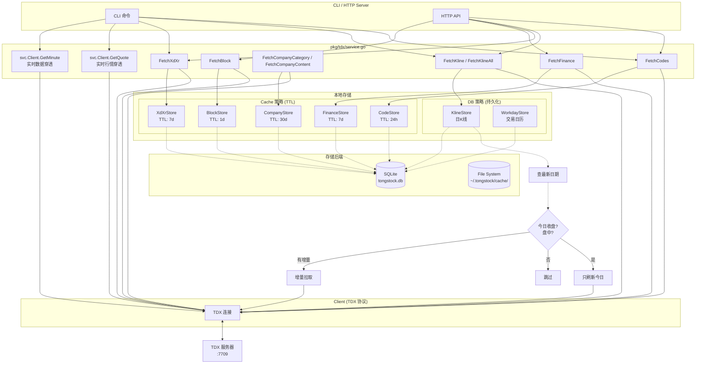
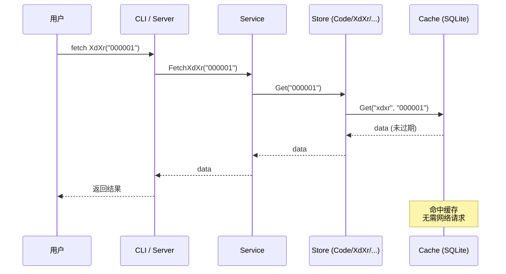
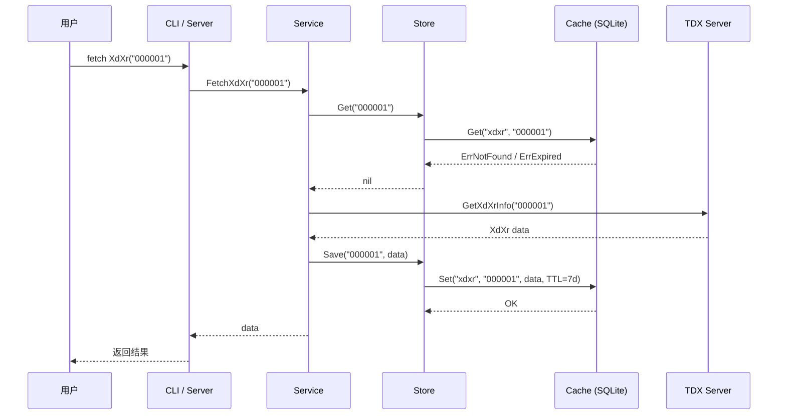
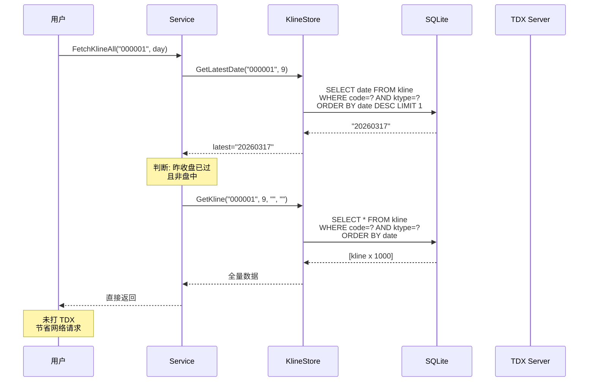
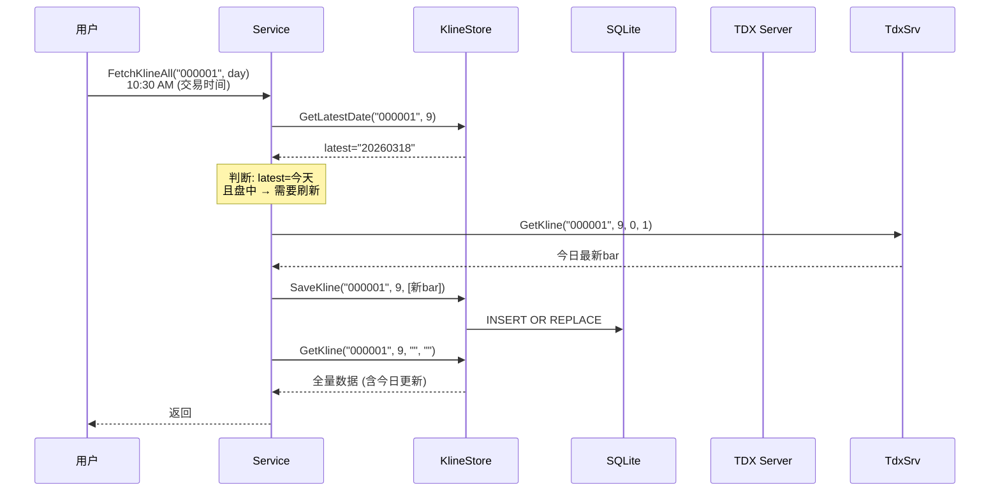
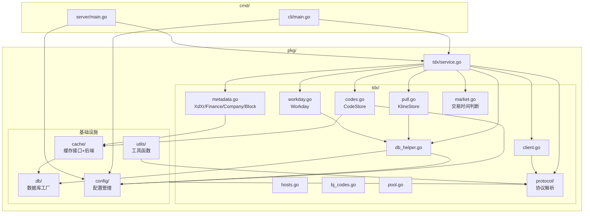
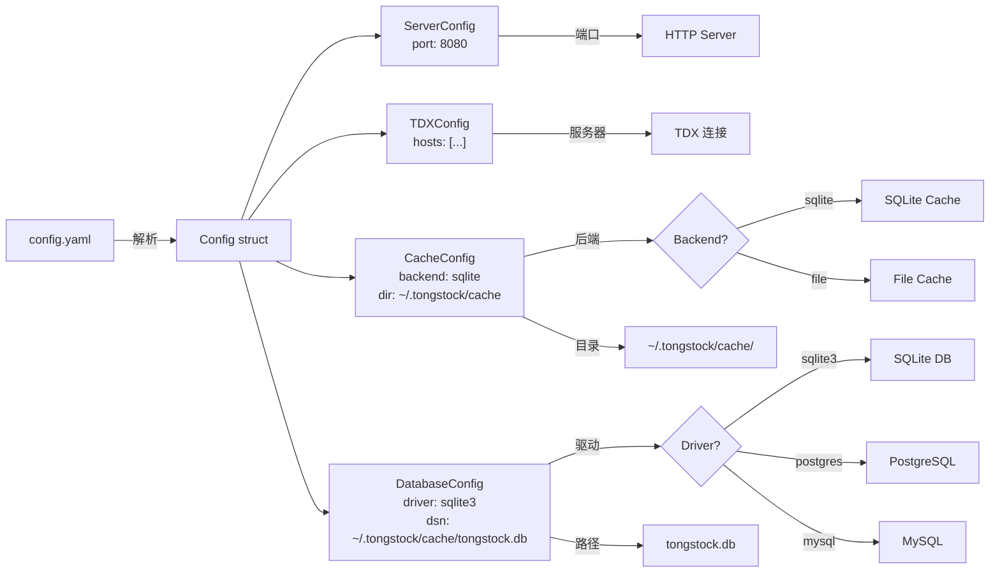
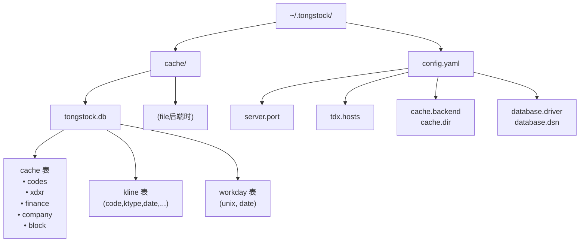

# 架构图

## 系统架构

```mermaid
flowchart TB
    subgraph CLI["CLI / HTTP Server"]
        CLI_CMD[CLI 命令]
        HTTP_API[HTTP API]
    end

    subgraph Service["pkg/tdx/service.go"]
        FetchCodes[FetchCodes]
        FetchKline[FetchKline / FetchKlineAll]
        FetchXdXr[FetchXdXr]
        FetchFinance[FetchFinance]
        FetchCompany[FetchCompanyCategory / FetchCompanyContent]
        FetchBlock[FetchBlock]
        FetchMinute[svc.Client.GetMinute<br/>实时数据穿透]
        FetchQuote[svc.Client.GetQuote<br/>实时行情穿透]
    end

    subgraph Client["Client (TDX 协议)"]
        Client_Conn[TDX 连接]
    end

    subgraph Stores["本地存储"]
        subgraph Cache_Stores["Cache 策略 (TTL)"]
            CodeStore[CodeStore<br/>TTL: 24h]
            XdXrStore[XdXrStore<br/>TTL: 7d]
            FinanceStore[FinanceStore<br/>TTL: 7d]
            CompanyStore[CompanyStore<br/>TTL: 30d]
            BlockStore[BlockStore<br/>TTL: 1d]
        end

        subgraph DB_Stores["DB 策略 (持久化)"]
            KlineStore[KlineStore<br/>日K线]
            WorkdayStore[WorkdayStore<br/>交易日历]
        end
    end

    subgraph Backends["存储后端"]
        SQLite[(SQLite<br/>tongstock.db)]
        File[(File System<br/>~/.tongstock/cache/)]
    end

    CLI_CMD --> FetchCodes
    CLI_CMD --> FetchKline
    CLI_CMD --> FetchXdXr
    CLI_CMD --> FetchQuote
    CLI_CMD --> FetchMinute

    HTTP_API --> FetchCodes
    HTTP_API --> FetchKline
    HTTP_API --> FetchXdXr
    HTTP_API --> FetchFinance
    HTTP_API --> FetchBlock

    FetchCodes --> Client_Conn
    FetchKline --> Client_Conn
    FetchXdXr --> Client_Conn
    FetchFinance --> Client_Conn
    FetchCompany --> Client_Conn
    FetchBlock --> Client_Conn

    FetchQuote --> Client_Conn
    FetchMinute --> Client_Conn

    FetchCodes --> CodeStore
    FetchXdXr --> XdXrStore
    FetchFinance --> FinanceStore
    FetchCompany --> CompanyStore
    FetchBlock --> BlockStore

    FetchKline --> KlineStore
    KlineStore -.-> KlineStore_GetLatest[查最新日期]
    KlineStore_GetLatest -.-> KlineSmart{今日收盘?<br/>盘中?}
    KlineSmart -->|"是"| KlineRefresh[只刷新今日]
    KlineSmart -->|"否"| KlineSkip[跳过]
    KlineSmart -->|"有增量"| KlineIncremental[增量拉取]

    KlineRefresh --> Client_Conn
    KlineIncremental --> Client_Conn

    CodeStore -.-> SQLite
    XdXrStore -.-> SQLite
    FinanceStore -.-> SQLite
    CompanyStore -.-> SQLite
    BlockStore -.-> SQLite

    KlineStore -.-> SQLite
    WorkdayStore -.-> SQLite

    Client_Conn <--> TDX_Server[TDX 服务器<br/>:7709]
```

## 数据流: 缓存命中

```mermaid
sequenceDiagram
    participant User as 用户
    participant CLI as CLI / Server
    participant Svc as Service
    participant Store as Store (Code/XdXr/...)
    participant Cache as Cache (SQLite)

    User->>CLI: fetch XdXr("000001")
    CLI->>Svc: FetchXdXr("000001")
    Svc->>Store: Get("000001")
    Store->>Cache: Get("xdxr", "000001")
    Cache-->>Store: data (未过期)
    Store-->>Svc: data
    Svc-->>CLI: data
    CLI-->>User: 返回结果

    Note over Cache: 命中缓存<br/>无需网络请求
```

## 数据流: 缓存未命中

```mermaid
sequenceDiagram
    participant User as 用户
    participant CLI as CLI / Server
    participant Svc as Service
    participant Store as Store
    participant Cache as Cache (SQLite)
    participant TDX as TDX Server

    User->>CLI: fetch XdXr("000001")
    CLI->>Svc: FetchXdXr("000001")
    Svc->>Store: Get("000001")
    Store->>Cache: Get("xdxr", "000001")
    Cache-->>Store: ErrNotFound / ErrExpired
    Store-->>Svc: nil
    Svc->>TDX: GetXdXrInfo("000001")
    TDX-->>Svc: XdXr data
    Svc->>Store: Save("000001", data)
    Store->>Cache: Set("xdxr", "000001", data, TTL=7d)
    Cache-->>Store: OK
    Svc-->>CLI: data
    CLI-->>User: 返回结果
```

## 数据流: K线日线增量更新

```mermaid
sequenceDiagram
    participant User as 用户
    participant Svc as Service
    participant Kline as KlineStore
    participant DB as SQLite
    participant TDX as TDX Server

    User->>Svc: FetchKlineAll("000001", day)
    Svc->>Kline: GetLatestDate("000001", 9)
    Kline->>DB: SELECT date FROM kline<br/>WHERE code=? AND ktype=?<br/>ORDER BY date DESC LIMIT 1
    DB-->>Kline: "20260317"
    Kline-->>Svc: latest="20260317"

    Note over Svc: 判断: 昨收盘已过<br/>且非盘中

    Svc->>Kline: GetKline("000001", 9, "", "")
    Kline->>DB: SELECT * FROM kline<br/>WHERE code=? AND ktype=?<br/>ORDER BY date
    DB-->>Kline: [kline x 1000]
    Kline-->>Svc: 全量数据
    Svc-->>User: 直接返回

    Note over User: 未打 TDX<br/>节省网络请求
```

## 数据流: K线盘中刷新

```mermaid
sequenceDiagram
    participant User as 用户
    participant Svc as Service
    participant Kline as KlineStore
    participant DB as SQLite
    participant TDX as TDX Server

    User->>Svc: FetchKlineAll("000001", day)<br/>10:30 AM (交易时间)
    Svc->>Kline: GetLatestDate("000001", 9)
    Kline-->>Svc: latest="20260318"

    Note over Svc: 判断: latest=今天<br/>且盘中 → 需要刷新

    Svc->>TdxSrv: GetKline("000001", 9, 0, 1)
    TdxSrv-->>Svc: 今日最新bar
    Svc->>Kline: SaveKline("000001", 9, [新bar])
    Kline->>DB: INSERT OR REPLACE
    Svc->>Kline: GetKline("000001", 9, "", "")
    Kline-->>Svc: 全量数据 (含今日更新)
    Svc-->>User: 返回
```

## 模块依赖关系

```mermaid
graph TB
    subgraph cmd["cmd/"]
        cli[cli/main.go]
        server[server/main.go]
    end

    subgraph pkg["pkg/"]
        service[tdx/service.go]
        
        subgraph tdx["tdx/"]
            client[client.go]
            pull[pull.go<br/>KlineStore]
            workday[workday.go<br/>Workday]
            codes[codes.go<br/>CodeStore]
            metadata[metadata.go<br/>XdXr/Finance/Company/Block]
            market[market.go<br/>交易时间判断]
            db_helper[db_helper.go]
            hosts[hosts.go]
            bj_codes[bj_codes.go]
            pool[pool.go]
            protocol[protocol/<br/>协议解析]
        end

        subgraph infra["基础设施"]
            cache[cache/<br/>缓存接口+后端]
            db[db/<br/>数据库工厂]
            config[config/<br/>配置管理]
            utils[utils/<br/>工具函数]
        end
    end

    cli --> config
    cli --> service
    server --> config
    server --> service

    service --> client
    service --> pull
    service --> workday
    service --> codes
    service --> metadata
    service --> market
    service --> db_helper
    service --> protocol

    client --> protocol
    pull --> db_helper
    workday --> db_helper
    codes --> cache
    codes --> config
    metadata --> cache
    db_helper --> db
    db_helper --> config

    cache --> db

    infra --> protocol
    utils --> protocol
```

## 配置文件结构

```mermaid
graph LR
    config[config.yaml] -->|解析| cfg["Config struct"]
    
    cfg --> server["ServerConfig\nport: 8080"]
    cfg --> tdx["TDXConfig\nhosts: [...]"]
    cfg --> cache_cfg["CacheConfig\nbackend: sqlite\ndir: ~/.tongstock/cache"]
    cfg --> db_cfg["DatabaseConfig\ndriver: sqlite3\ndsn: ~/.tongstock/cache/tongstock.db"]

    server -->|端口| http["HTTP Server"]
    tdx -->|服务器| tdx_conn["TDX 连接"]
    cache_cfg -->|后端| cache_backend{Backend?}
    cache_cfg -->|目录| cache_dir["~/.tongstock/cache/"]
    db_cfg -->|驱动| db_driver{Driver?}
    db_cfg -->|路径| db_path["tongstock.db"]

    cache_backend -->|"sqlite"| sqlite_cache[SQLite Cache]
    cache_backend -->|"file"| file_cache[File Cache]
    db_driver -->|"sqlite3"| sqlite_db[SQLite DB]
    db_driver -->|"postgres"| postgres_db[PostgreSQL]
    db_driver -->|"mysql"| mysql_db[MySQL]
```

## 存储位置

```mermaid
graph TD
    home["~/.tongstock/"]
    
    home --> config["config.yaml"]
    home --> cache_dir["cache/"]
    
    cache_dir --> tongstock_db["tongstock.db"]
    cache_dir --> file_cache["(file后端时)"]
    
    tongstock_db --> cache_table["cache 表\n• codes\n• xdxr\n• finance\n• company\n• block"]
    tongstock_db --> kline_table["kline 表\n(code,ktype,date,...)"]
    tongstock_db --> workday_table["workday 表\n(unix, date)"]

    config --> server_cfg["server.port"]
    config --> tdx_cfg["tdx.hosts"]
    config --> cache_cfg["cache.backend\ncache.dir"]
    config --> db_cfg["database.driver\ndatabase.dsn"]
```
